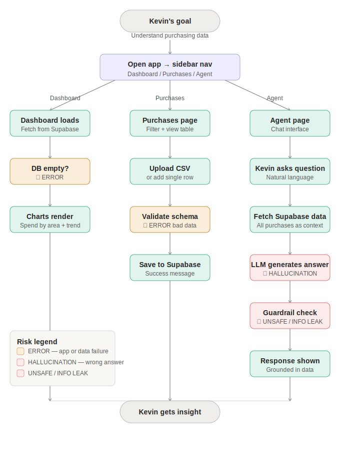

# Makerspace Purchasing App

**TECHIN 510 — Week 8: Testing & Evaluation | Team 9 | Peerayad Dumrongpun**

A web app for Kevin, the GIX makerspace manager at the University of Washington, to track, analyze, and query historical purchasing data using a custom category schema and an AI agent.

**[Live App](https://bf9wu8fdi5bjux27fv5v6z.streamlit.app/)**

---

## What It Does

Kevin spends $40,000–$50,000 per year on makerspace supplies. The university's Workday system categorizes nearly everything as "Other Supplies," making budget planning impossible. This app gives Kevin:

- A **dashboard** to visualize spending by his own category schema (area + type)
- A **purchases table** to upload, filter, and manage transaction records
- An **AI agent** to ask natural-language questions about purchasing data

---

## User Flow Diagram



---

## Tech Stack

| Layer | Technology |
|---|---|
| Frontend | Streamlit (Python) |
| Database | Supabase (PostgreSQL) |
| AI Agent | Groq API — llama-3.1-8b-instant |
| Deployment | Streamlit Community Cloud |

---

## Project Structure

```
lab-8-peerayad/
├── app.py                    # Main Streamlit app (3 pages)
├── agent.py                  # Groq AI agent with guardrails
├── database.py               # Supabase client, CRUD, schema constants
├── config.py                 # Secret loading (.env local / st.secrets Cloud)
├── data/
│   └── sample_purchases.csv  # 26-row seed dataset (2022–2024)
├── requirements.txt
├── .env.example              # Credentials template
├── user_flow_diagram.svg     # User flow with risk labels
└── README.md
```

---

## Local Setup

**1. Clone the repo**

```bash
git clone https://github.com/peerayad/techin510-lab8.git
cd techin510-lab8
```

**2. Install dependencies**

```bash
pip install -r requirements.txt
```

**3. Set up credentials**

```bash
cp .env.example .env
# Edit .env with your real keys
```

Your `.env` should contain:

```
SUPABASE_URL=https://your-project.supabase.co
SUPABASE_KEY=your-anon-key
GROQ_API_KEY=your-groq-key
```

**4. Create the Supabase table**

Run this SQL in your Supabase SQL editor:

```sql
create table purchases (
  id bigint generated always as identity primary key,
  date text,
  vendor text,
  description text,
  amount float8,
  area text,
  type text,
  workday_category text,
  pca_code text,
  invoice_number text,
  po_number text,
  notes text
);
```

**5. Seed the database**

```bash
python3 database.py
```

**6. Run the app**

```bash
streamlit run app.py
```

---

## Deployment (Streamlit Cloud)

1. Push this repo to GitHub
2. Go to [share.streamlit.io](https://share.streamlit.io) and connect the repo
3. Set main file to `app.py`
4. Add secrets under **Settings > Secrets**:

```toml
SUPABASE_URL = "https://your-project.supabase.co"
SUPABASE_KEY = "your-anon-key"
GROQ_API_KEY = "your-groq-key"
```

---

## API Keys

- **Supabase:** [supabase.com](https://supabase.com) → Settings → API Keys
- **Groq:** [console.groq.com](https://console.groq.com) → API Keys (free tier)
